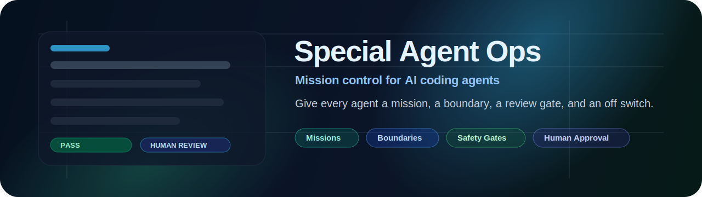

<p align="center">
  
</p>

# Special Agent Ops

[](https://github.com/gorillapioneer/special-agent-ops/actions/workflows/safety-checks.yml)

**A black box recorder and local control room for AI coding agents.**

AI agents can change a lot of code quickly. Special Agent Ops records what happened, what changed, what passed, what failed, and whether the mission archive can be verified.

---

## Features

- **Mission recorder** — runs any command and captures the full session
- **Git diff capture** — records `git status` and a unified diff before and after
- **stdout / stderr capture** — full output saved to text files
- **Tamper-evident SHA256 seal** — manifest, archive, and directory hashes written to `seal.json`
- **Shareable Markdown mission card** — compact `seal_card.md` for issues and PR comments
- **Standalone HTML mission card** — dark-themed `seal_card.html`, no external assets
- **Compact QR-ready seal payload** — minimal JSON sized to fit a standard QR code
- **Mission browser CLI** — `sao list`, `sao show`, `sao verify`
- **Archive verification** — `sao verify-archive` confirms integrity from a `.zip` alone
- **Local mission dashboard** — `sao dashboard` serves a mission index on `127.0.0.1`

No external dependencies. Standard library only. Windows and Unix compatible.

---

## Quickstart

```bash
# No install needed — run directly
python -m sao.cli run --name "first mission" --command "python --version"

# Or install as a CLI tool
pip install -e .
sao run --name "first mission" --command "python --version"
```

Then browse your missions:

```bash
sao list
sao show <mission_id>
sao verify <mission_id>
sao open <mission_id>
sao dashboard --port 8765
```

---

## Example output

```
================================================================
  SPECIAL AGENT OPS — MISSION COMPLETE
================================================================
  Mission ID:      20260506_091500_pytest_baseline
  Status:          PASS
  Command:         python -m pytest tests/ -x -q
  Exit Code:       0
  Changed Files:   3
  Session Folder:  blackbox/sessions/20260506_091500_pytest_baseline
  Archive:         blackbox/sessions/20260506_091500_pytest_baseline.zip
  Archive SHA256:  a665a45920422f9d...4b56e7a8
  Seal:            blackbox/sessions/20260506_091500_pytest_baseline/seal.json
  Seal Card:       blackbox/sessions/20260506_091500_pytest_baseline/seal_card.md
  HTML Card:       blackbox/sessions/20260506_091500_pytest_baseline/seal_card.html
  QR Payload:      blackbox/sessions/20260506_091500_pytest_baseline/seal_qr_payload.json
================================================================
```

---

## Generated files

Each mission session creates a folder under `blackbox/sessions/<mission_id>/`:

| File | Contents |
|---|---|
| `manifest.json` | Mission metadata, timing, exit code, branch, changed files |
| `stdout.txt` | Full command stdout |
| `stderr.txt` | Full command stderr |
| `git_status_before.txt` | `git status --short` before the command |
| `git_status_after.txt` | `git status --short` after |
| `git_diff.patch` | Unified diff of all uncommitted changes |
| `seal.json` | SHA256 tamper-evident seal (machine-readable) |
| `seal.txt` | SHA256 tamper-evident seal (human-readable) |
| `seal_payload.json` | Compact mission card payload |
| `seal_card.md` | Shareable Markdown mission card |
| `seal_card.html` | Standalone HTML mission card (browser/screenshot-ready) |
| `seal_qr_payload.json` | Compact QR-ready payload (no whitespace JSON) |
| `seal_qr_payload.txt` | Same compact QR payload as plain text |
| `mission_summary.md` | Human-readable summary of the session |

The whole session folder is also compressed to `<mission_id>.zip`. Sessions are stored under `blackbox/sessions/` (excluded from git by `.gitignore`).

---

## CLI reference

| Command | What it does |
|---|---|
| `sao run --name "..." --command "..."` | Record a mission session |
| `sao list` | List all recorded missions |
| `sao show <mission_id>` | Show full metadata for one mission |
| `sao verify <mission_id>` | Verify SHA256 seals against the session folder |
| `sao verify-archive <path>.zip` | Verify SHA256 seals from a `.zip` archive |
| `sao open <mission_id>` | Open the HTML mission card in the default browser |
| `sao dashboard [--port N]` | Start a local dashboard (default port 8765) |

Source: [`sao/`](sao/)

---

## Mission Seal

Each mission generates a SHA256 seal so you can verify the archive has not been changed after recording.

```
SPECIAL AGENT OPS MISSION SEAL
Mission ID: 20260506_091500_pytest_baseline
Created At: 2026-05-06T09:15:05.123456+00:00
Manifest SHA256: e3b0c44298fc1c14...
Archive SHA256:  a665a45920422f9d...
Session Directory SHA256: 2cf24dba5fb0a30e...
Seal Version: 0.2
```

The seal covers:
- **manifest_sha256** — the mission metadata file
- **archive_sha256** — the compressed `.zip` archive
- **session_directory_sha256** — a combined hash of every raw data file in the session folder

To verify an archive manually: compare its SHA256 against `archive_sha256` in `seal.json` or `seal.txt`.

### Mission Card

Each mission also creates a compact seal payload and a Markdown mission card that can be shared in issues, pull requests, release notes, or dashboards.

**`seal_payload.json`** — machine-readable compact snapshot:
```json
{
  "mission_id": "20260506_091500_pytest_baseline",
  "name": "pytest baseline",
  "status": "PASS",
  "exit_code": 0,
  "changed_files_count": 3,
  "archive_sha256": "a665a45920422f9d...",
  "seal_version": "0.2"
}
```

**`seal_card.md`** — shareable Markdown card:
```
# SPECIAL AGENT OPS MISSION CARD

Mission: pytest baseline
Mission ID: 20260506_091500_pytest_baseline
Status: PASS
Command: `python -m pytest tests/ -x -q`
Changed Files: 3
Archive SHA256: `a665a45920422f9d...`
Seal Version: 0.2

Recorded by Special Agent Ops.
```

### QR Seal Payload

Each mission also creates a compact QR-ready payload — a minimal JSON snapshot sized to fit inside a standard QR code.

**`seal_qr_payload.json`** and **`seal_qr_payload.txt`** — identical compact JSON, no whitespace:
```
{"sao":"0.4","id":"20260506_091500_pytest_baseline","status":"PASS","sha256":"a665a45920422f9d...","seal":"0.2"}
```

Fields:

| Key | Value |
|---|---|
| `sao` | QR payload version (`"0.4"`) |
| `id` | Mission ID |
| `status` | `"PASS"` or `"FAIL"` |
| `sha256` | Archive SHA256 (full 64-char hex) |
| `seal` | Seal version from `seal.json` |

No QR image is generated — the payload file is the input. Point any QR encoder at `seal_qr_payload.txt` to produce a scannable code.

---

## HTML Mission Card

Each mission creates a standalone HTML card that can be opened in a browser or attached to issues/PRs as visual proof of a recorded agent mission.

**`seal_card.html`** — dark-themed, screenshot-ready, zero external assets:

- Mission name and ID
- PASS / FAIL badge
- Command, changed files count, timing
- Full archive SHA256
- QR payload text in a compact code block

No JavaScript, no external CSS, no remote images — the file is completely self-contained and safe to attach or embed anywhere.

Source: [`sao/blackbox/html_card.py`](sao/blackbox/html_card.py)

---

## Open Mission Card

Use `sao open <mission_id>` to open a recorded mission's standalone HTML card in your default browser.

```bash
python -m sao.cli open 20260506_091500_pytest_baseline
```

Output:

```
================================================================
  SPECIAL AGENT OPS — OPEN
================================================================
  Mission ID:  20260506_091500_pytest_baseline
  HTML Card:   .../seal_card.html
================================================================
  Result: OPENED
================================================================
```

Exits with code `1` if the mission is not found or `seal_card.html` does not exist (e.g. session recorded before v0.7).

---

## Mini Dashboard

Use `sao dashboard` to open a local dashboard listing recorded missions and links to their mission cards, summaries, and QR payloads.

```bash
python -m sao.cli dashboard
# or on a custom port:
python -m sao.cli dashboard --port 9000
```

Output:

```
================================================================
  SPECIAL AGENT OPS — DASHBOARD
================================================================
  URL:            http://127.0.0.1:8765
  Sessions Root:  blackbox/sessions
  Press Ctrl+C to stop.
================================================================
```

Dashboard routes:

| Route | Serves |
|---|---|
| `/` | Mission index — table of all sessions |
| `/missions/<id>/card` | `seal_card.html` (HTML mission card) |
| `/missions/<id>/summary` | `mission_summary.md` (plain text) |
| `/missions/<id>/qr-payload` | `seal_qr_payload.txt` (compact QR JSON) |

The server binds to `127.0.0.1` only (loopback — not exposed to the network). Only the three known files above can be served from validated session folders. No arbitrary file access is possible.

Source: [`sao/blackbox/dashboard.py`](sao/blackbox/dashboard.py)

---

## Mission Browser CLI

Inspect and verify recorded sessions without opening any files manually.

```bash
# List all recorded missions
python -m sao.cli list

# Inspect a specific mission
python -m sao.cli show 20260506_091500_pytest_baseline

# Verify SHA256 seals for a mission
python -m sao.cli verify 20260506_091500_pytest_baseline
```

### sao list

Prints a compact table of every session in `blackbox/sessions/`, newest first:

```
Mission ID                          Status  Changed  Command
-------------------------------------------------------------------
20260506_091500_pytest_baseline     PASS          3  python -m pytest tests/ -x -q
20260506_090000_fail_demo           FAIL          5  python -c "raise SystemExit(42)"
```

### sao show \<mission_id\>

Prints full metadata for one session: name, status, timing, command, exit code, changed files, archive SHA256, and paths to the seal card, mission summary, and QR payload.

### sao verify \<mission_id\>

Recomputes SHA256 hashes and confirms they match `seal.json`. Uses the same algorithm as the recorder so the result is trustworthy.

```
================================================================
  SPECIAL AGENT OPS — VERIFY
================================================================
  Mission ID:        20260506_091500_pytest_baseline
  Manifest:          OK
  Archive:           OK
  Session Directory: OK
================================================================
  Result: VERIFIED
================================================================
```

Exits with code `0` on VERIFIED, `1` on FAILED. Suitable for CI gates.

Source: [`sao/blackbox/browser.py`](sao/blackbox/browser.py)

### sao verify-archive \<archive_path\>

Verify a mission `.zip` archive directly — no session folder required, as long as `seal.json` is available.

```bash
python -m sao.cli verify-archive blackbox/sessions/20260506_091500_pytest_baseline.zip
```

Output:

```
================================================================
  SPECIAL AGENT OPS — VERIFY ARCHIVE
================================================================
  Archive:           .../20260506_091500_pytest_baseline.zip
  Mission ID:        20260506_091500_pytest_baseline
  Archive SHA256:    OK
  Manifest:          OK
  Session Directory: OK
================================================================
  Result: VERIFIED
================================================================
```

Checks performed:

| Check | How |
|---|---|
| Archive SHA256 | Recomputes SHA256 of the provided `.zip` file |
| Manifest | Extracts `manifest.json` from the zip, recomputes its hash |
| Session Directory | Extracts all data files, recomputes the directory hash |

`seal.json` is located automatically — first from the session folder alongside the archive, then from a companion `<archive>.seal.json` file. To distribute an archive for portable offline verification:

```bash
# Copy the zip and its seal together
cp blackbox/sessions/<mission_id>.zip          /path/to/share/
cp blackbox/sessions/<mission_id>/seal.json    /path/to/share/<mission_id>.seal.json
```

Exits with code `0` on VERIFIED, `1` on any mismatch.

---

## Security notes

- **Commands are user-supplied and executed locally.** `sao run` passes `--command` directly to the OS shell. Never record commands from untrusted sources.
- **Do not run untrusted commands.** If an agent generates the command, review it before recording.
- **`blackbox/sessions` is gitignored.** Session folders may contain stdout, diffs, and file paths that include sensitive information. They are excluded from git by default.
- **The dashboard only serves allowlisted files.** `sao dashboard` serves only `seal_card.html`, `mission_summary.md`, and `seal_qr_payload.txt` from validated session folders. No arbitrary paths can be accessed.
- **Hashes prove whether files changed after recording, not whether the command was safe.** A VERIFIED result means the recorded data is intact — it says nothing about whether the agent's behaviour was correct or safe.

See [`docs/SECURITY_MODEL.md`](docs/SECURITY_MODEL.md) for a full explanation.

---

## How it works

```
Mission Brief
  |
  v
Planner Agent
  |
  v
Human Approves Plan
  |
  v
Builder Agent opens PR
  |
  v
Safety Checks + No-Secrets Scan
  |
  v
Reviewer Agent + Diff Explainer
  |
  v
Human Merge
  |
  v
Release Notes + Rollback Plan
```

The point is simple: agents can move fast, but humans set the mission, approve the plan, review the PR, and own the merge.

---

## Start in 5 minutes

1. Copy the starter templates into your repo.
2. Fill out `MISSION_BRIEF.md` with one clear task and explicit out-of-scope items.
3. Define `SAFE_REPO_BOUNDARIES.md` so the agent knows what it can and cannot touch.
4. Run `python scripts/safety-gate.py --tree`.
5. Open a pull request for the agent-produced change.
6. Require human approval before merge.

Start with a docs-only mission if this is your first run. Then use the [`PR safety demo`](examples/pr-safety-demo/README.md) to see the full loop.

---

## What to copy first

- [`templates/MISSION_BRIEF.md`](templates/MISSION_BRIEF.md)
- [`templates/AGENT_RULES.md`](templates/AGENT_RULES.md)
- [`templates/SAFE_REPO_BOUNDARIES.md`](templates/SAFE_REPO_BOUNDARIES.md)
- [`templates/PR_CHECKLIST.md`](templates/PR_CHECKLIST.md)
- [`prompts/planner-agent.md`](prompts/planner-agent.md)
- [`prompts/codex-reviewer-agent.md`](prompts/codex-reviewer-agent.md)

---

## What this is

Special Agent Ops is a collection of templates, prompts, workflows, and scripts for developers and teams who want to use AI coding agents — Claude, Codex, v0, Devin-style tools — without losing control of their codebase.

The core idea: **give every agent a mission, a boundary, a review gate, and an off switch.**

This repo helps you coordinate:
- Claude (mobile, web, and Claude Code local)
- GitHub Copilot / Codex
- v0 (UI generation)
- Devin-style autonomous agents
- GitHub PR workflows
- Local and private repo workflows

## What this is not

- Not a framework or SDK you install
- Not an autonomous coding system
- Not a replacement for human developers
- Not a claim that agents are reliable enough to ship unsupervised
- Not hype

## Why AI agent control matters

AI coding agents are fast, capable, and increasingly useful. They can also:

- Write plausible-looking code that does the wrong thing
- Accidentally expose API keys or secrets
- Delete or overwrite things outside their intended scope
- Make large sweeping changes that are difficult to review
- Chain multiple actions in ways the original prompt never intended

The problem isn't the agents themselves. The problem is treating them like autonomous contractors when they should be treated more like fast, tireless, occasionally overconfident collaborators — ones who need clear scope, structured supervision, and a human review before anything merges.

This repo gives you the scaffolding to do that well.

---

## Agent Roster

Each "agent" is a role — a focused job assigned to one AI session, tool, or workflow step. No single agent owns the whole codebase.

| Role | Job | Typical Tool |
|---|---|---|
| **Planner Agent** | Break task into scoped sub-tasks, identify risks, produce mission brief | Claude web / mobile |
| **Builder Agent** | Implement one scoped task on a branch | Claude Code local / Codex |
| **Reviewer Agent** | Review the PR diff, flag logic issues and regressions | Claude web / GitHub Copilot |
| **Safety Gate Agent** | Check for secrets, risky file paths, deletion-heavy changes | `scripts/safety-gate.py` + Claude |
| **Diff Explainer Agent** | Produce plain-English summary of every change in the PR | Claude web / mobile |
| **Test Runner Agent** | Run tests, report failures, suggest missing test cases | Claude Code / CI |
| **No-Secrets Agent** | Scan staged files and diff for leaked credentials | `scripts/check-secrets.*` |
| **Release Manager Agent** | Draft release notes, tag version, confirm deploy checklist | Claude web |
| **Rollback Agent** | Identify rollback path, produce revert instructions if deploy fails | Claude web / mobile |

See [`docs/agent-roster.md`](docs/agent-roster.md) for full role descriptions and example prompts for each.

---

## Mission Flow

Every task follows the same sequence. No skipping steps.

```
Task idea
   │
   ▼
Mission Brief (fill MISSION_BRIEF.md template)
   │
   ▼
Planner Agent → scoped sub-tasks + risk flags
   │
   ▼
Human approval ← GATE 1
   │
   ▼
Builder Agent works on feature branch
   │
   ▼
No-Secrets Agent scans staged changes
   │
   ▼
Safety Gate Agent reviews diff for risky paths
   │
   ▼
Test Runner Agent confirms tests pass
   │
   ▼
Pull Request opened
   │
   ▼
Reviewer Agent + Diff Explainer Agent
   │
   ▼
Human review and merge ← GATE 2
   │
   ▼
Release Manager Agent drafts release notes
   │
   ▼
Rollback plan documented before deploy
```

See [`docs/mission-flow.md`](docs/mission-flow.md) for detailed step descriptions.

---

## Risk Levels

Assign a risk level to every mission before you start. The level determines how much human oversight is required.

| Level | Colour | Meaning | Example |
|---|---|---|---|
| **GREEN** | 🟢 | Low risk, well-scoped, easy to revert | Fix a typo in docs, update a README, add a comment |
| **AMBER** | 🟡 | Moderate risk, requires PR review | New feature on a branch, refactor of isolated module |
| **RED** | 🔴 | High risk, requires human sign-off before and after | Auth changes, payment code, database migrations |
| **BLACK** | ⬛ | Do not delegate to an AI agent | Production secrets, live trading logic, compliance-critical code |

BLACK-level code should never be handed to an agent session, even with instructions not to touch it. Remove it from context entirely.

See [`docs/risk-levels.md`](docs/risk-levels.md) for detailed guidance.

---

## Public vs Private Repos

The workflow is the same, but the risks are different.

**Public repos:** Agents can accidentally expose internal file structures, unfinished features, or organisation-specific naming conventions in commits, PR descriptions, and comments. Review everything before it's public.

**Private repos:** Secrets leaking into git history are still a real risk. Private does not mean safe. Run the no-secrets check regardless.

See [`docs/public-vs-private-repos.md`](docs/public-vs-private-repos.md) for a full breakdown.

---

## Example Prompts

Each prompt file in [`prompts/`](prompts/) is a ready-to-use system prompt or instruction block for a specific agent role.

| Prompt file | Use it when |
|---|---|
| [`prompts/planner-agent.md`](prompts/planner-agent.md) | Starting a new task, need a scoped plan |
| [`prompts/builder-agent.md`](prompts/builder-agent.md) | Handing a scoped task to Claude Code or Codex |
| [`prompts/codex-reviewer-agent.md`](prompts/codex-reviewer-agent.md) | Reviewing Codex-generated output |
| [`prompts/safety-gate-agent.md`](prompts/safety-gate-agent.md) | Running a pre-merge safety check |
| [`prompts/diff-explainer-agent.md`](prompts/diff-explainer-agent.md) | Getting a plain-English diff summary |
| [`prompts/test-runner-agent.md`](prompts/test-runner-agent.md) | Confirming test coverage and results |
| [`prompts/no-secrets-agent.md`](prompts/no-secrets-agent.md) | Scanning for leaked credentials |
| [`prompts/release-manager-agent.md`](prompts/release-manager-agent.md) | Drafting release notes |
| [`prompts/rollback-agent.md`](prompts/rollback-agent.md) | Identifying rollback path before deploy |

---

## Scripts

| Script | What it does |
|---|---|
| [`scripts/safety-gate.py`](scripts/safety-gate.py) | Scans git diff or working tree for risky paths and patterns. Outputs PASS / WARN / BLOCK. No dependencies. |
| [`scripts/check-secrets.sh`](scripts/check-secrets.sh) | Bash script: reports likely secrets and risky secret file names. Exits nonzero on findings. No writes. |
| [`scripts/check-secrets.ps1`](scripts/check-secrets.ps1) | PowerShell equivalent for Windows workflows. Reports only; never deletes or modifies files. |

---

## Automated safety checks

GitHub Actions runs the same core checks on every push and pull request:

- Python safety gate: `python scripts/safety-gate.py --tree`
- PowerShell secrets check: `pwsh ./scripts/check-secrets.ps1 -All`
- Bash secrets check: `bash scripts/check-secrets.sh --all`

PRs should pass all three before human review and merge. CI is a filter, not an approval gate: a human still reads the mission, the diff, the safety results, and the rollback notes before merging.

See [`docs/ci-safety-checks.md`](docs/ci-safety-checks.md) for failure handling and review guidance.
See [`docs/branch-protection.md`](docs/branch-protection.md) for making these checks required before merge.

---

## Workflow Examples

| Example | Risk level | Description |
|---|---|---|
| [`examples/docs-only-task/`](examples/docs-only-task/README.md) | 🟢 GREEN | Update documentation with no code changes |
| [`examples/frontend-polish-task/`](examples/frontend-polish-task/README.md) | 🟡 AMBER | UI copy and style tweaks via PR |
| [`examples/safe-bugfix-task/`](examples/safe-bugfix-task/README.md) | 🟡 AMBER | Fix a scoped non-auth bug on a branch |
| [`examples/pr-review-task/`](examples/pr-review-task/README.md) | 🟢 GREEN | Use an agent to review a PR diff before human merge |
| [`examples/pr-safety-demo/`](examples/pr-safety-demo/README.md) | 🟡 AMBER | Walk through mission, safety checks, review, approval, and rollback |
| [`examples/mission_card_example.md`](examples/mission_card_example.md) | — | Example mission card with verification instructions |

---

## Roadmap

See [`docs/ROADMAP.md`](docs/ROADMAP.md) for the full roadmap. Highlights:

- [ ] v1.1 — QR image generation
- [ ] v1.2 — MapRoom repo graph
- [ ] v1.3 — Agent wrappers for Claude Code / Codex / Devin
- [ ] v1.4 — Pull request mission reports and CI artifact upload
- [ ] Later — Compressed binary event stream (MessagePack / CBOR / Zstd)

---

## Release Readiness

For v1.0 launch prep, use:

- [`CHANGELOG.md`](CHANGELOG.md) for the full version history.
- [`RELEASE_NOTES.md`](RELEASE_NOTES.md) for included scope, verification steps, limitations, and roadmap.
- [`docs/launch-checklist.md`](docs/launch-checklist.md) for repo metadata, pre-launch checks, release steps, and post-launch checks.

Do not publish a release, announcement, or launch post until the safety gate and no-secrets checks pass cleanly.

---

## Contributing

See [`CONTRIBUTING.md`](CONTRIBUTING.md).

## Security

See [`SECURITY.md`](SECURITY.md) and [`docs/SECURITY_MODEL.md`](docs/SECURITY_MODEL.md).

## License

MIT — see [`LICENSE`](LICENSE).

---

*Special Agent Ops is a community resource, not a product. There is no guarantee that following these workflows will prevent all agent mistakes. Human review is always required.*
